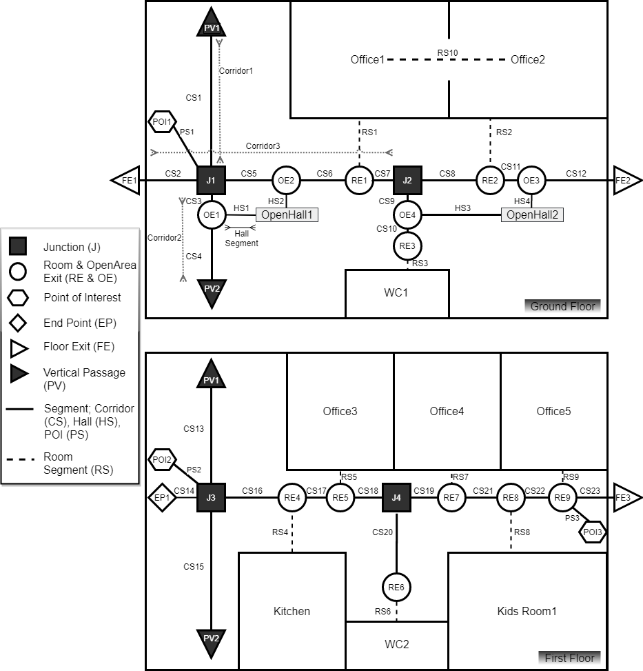
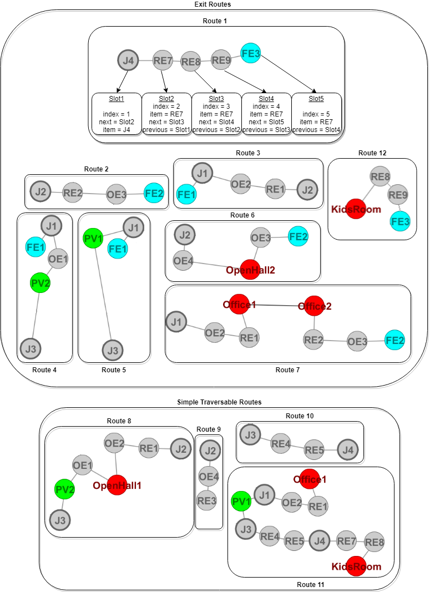

# Small Office Space Scenario Using SBEO

## Introduction
It is an instantiation of SBEO to represent a multi-storey small office space scenario consists of multiple offices, kitchen and Kids area. Also, it has an elevator, stairs and 2 emergency exits other than the main entrance. There are 7 persons located in the building space in which some of them have various types of impairments and some have family ties between them.  

The office space can be considered as a smart space as it is equipped with different sensors such as location, temperature and smoke. In addition, fire incident equipment, alerting device such as speakers, and a monitor screen are also installed in it.

## Figures

### Floor Plan

  

### Route Graph Overlaid With Building Floor Plan

  

### Undirected Graph Representation of Building Floor Plan

  

### Some Possible Routes in the Above-Mentioned Undirected Graph

  

