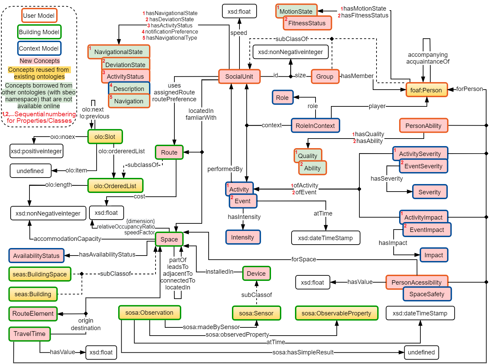

# SBEO : Smart Building Evacuation Ontology

## Introduction

Smart Building Evacuation Ontology (SBEO) couples the information about any building with its occupants such that it can be used in many useful ways. For example, indoor localization of people, detection of any hazard, a recommendation of normal routes such as shopping or stadium seating routes, or safe and feasible emergency evacuation routes or both of them all together.

The core SBEO covers the concepts related to the geometry of building, devices and components of the building, route graphs correspondent to the building topology, users’ characteristics and preferences, situational awareness of both building (hazard detection, status of spaces (or routes) in terms of availability and occupancy) and users (tracking, management of groups, status in terms of fitness), and emergency evacuation.

Several other parameters related to the spaces, users and context are also described in SBEO. For example, SpaceSafety, PersonAccessbility, etc. Moreover, intensity, severity, and the impact of events and activites are also conceptualized.

Namespace URI: 

> <i class="icon-file"></i>`https://w3id.org/sbeo#`

## Diagram 

### SBEO In A Nutshell

  

### Class Diagram

  

  

## Contacts

- Qasim Khalid <`qasim.khalid [at] urjc.es`>
- Alberto Fernandez Gil <`alberto.fernandez [at] urjc.es`>
- Marin Lujak <`marin.lujak [at] urjc.es `>
- Arnaud Doniec <`arnaud.doniec [at] imt-nord-europe.fr `>
