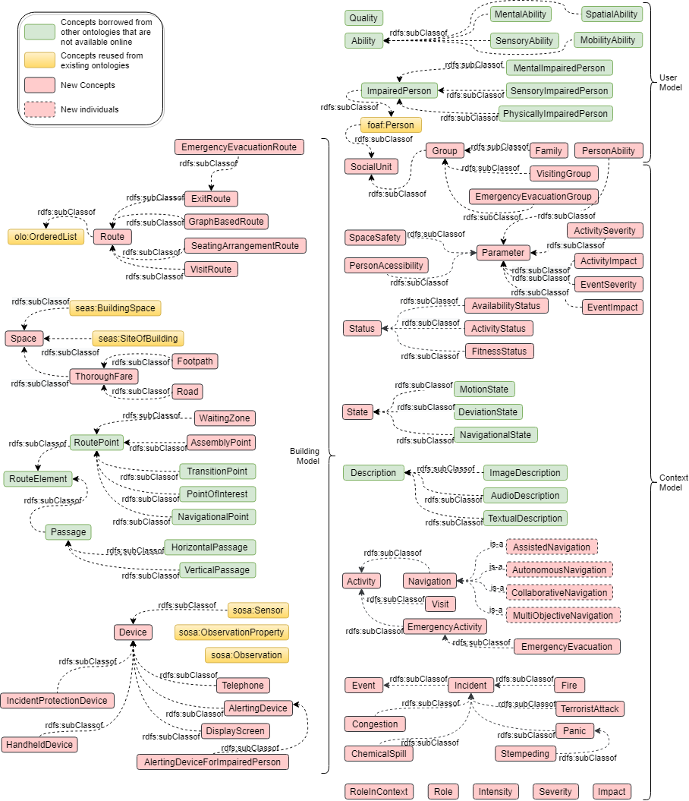

# SBEO : Smart Building Evacuation Ontology

##Introduction

Smart Building Evacuation Ontology (SBEO) is an ontology that couples the information about an indoor environment and its occupants such that it can be used in many useful ways. For example, indoor localization of people, detection of any hazard, a recommendation of normal routes such as shopping or stadium seating routes, or safe and feasible emergency evacuation routes or both of them all together.  

The core SBEO covers the concepts related to the geometry of building, devices and components of the building, route graphs correspondent to the building topology, users’ characteristics and preferences, situational awareness of both building (hazard detection, status of routes in terms of availability and occupancy) and users (tracking, management of groups, status in terms of fitness), and emergency evacuation.

##Diagram 

###Class Diagram

  

